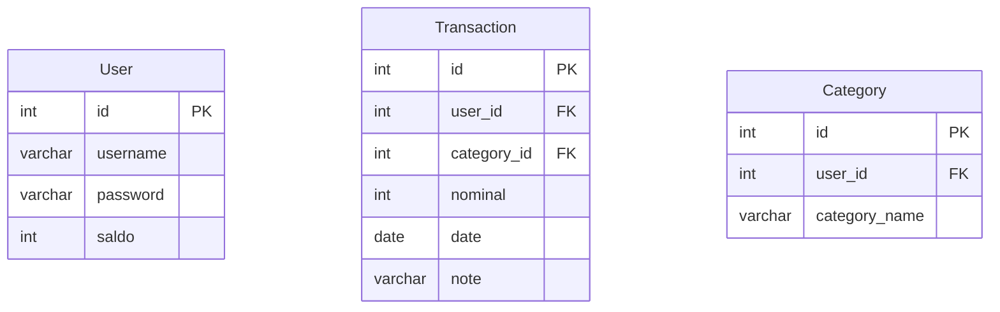

# basisdata
Tugas akhir mata kuliah Basis Data

# Deskripsi
Lorem ipsum dolor sit amet, consectetur adipiscing elit, sed do eiusmod tempor incididunt ut labore et dolore magna aliqua. Ut enim ad minim veniam, quis nostrud exercitation ullamco laboris nisi ut aliquip ex ea commodo consequat. Duis aute irure dolor in reprehenderit in voluptate velit esse cillum dolore eu fugiat nulla pariatur. Excepteur sint occaecat cupidatat non proident, sunt in culpa qui officia deserunt mollit anim id est laborum.

# TODO
- [ ] user update and delete
- [ ] front end

# Tech Stack
- [Django](https://www.djangoproject.com/)
- [Bootstrap](https://getbootstrap.com/)
- [PostgreSQL](https://www.postgresql.org/)
- [SQLite](https://www.sqlite.org/index.html)

# Anggota Kelompok
|Nama|NIM|
|--|--|
|Andyana Lilmuttaqina Mafaza|G6401211002
|Irfan Alamsyah|G6401211029|
|Andra Dihat Putra|G6401211053|

# ERD


# Instalasi menggunakan Docker
## Prasyarat
- [Docker](https://docs.docker.com/get-docker/)

### 1. Clone repository ini
```bash
git clone https://github.com/irfanalmsyah/projectBasisData.git
```
### 2. Masuk ke direktori repository
```bash
cd projectBasisData
```
### 3. Buat file `.env` dari file [`.env.example`](.env.example)
```bash
cp .env.example .env
```
### 4. Jalankan docker-compose
```bash
docker-compose up
```
> server akan berjalan di `http://localhost:44444`

# Instalasi tanpa Docker
## Prasyarat
- Python 3.9 atau lebih tinggi
- PostgreSQL jika ingin menggunakan database PostgreSQL
### 1. Clone repository ini
```bash 
git clone https://github.com/irfanalmsyah/projectBasisData.git
```
### 2. Masuk ke direktori
```bash
cd projectBasisData
```
### 3. Install dependensi
```bash
pip3 install -r requirements.txt
```
atau
```bash
python3 -m pip install -r requirements.txt
```
### 4. Buat file .env sesuai dengan [`.env.example`](.env.example)
```bash
cp .env.example .env
```
### 5. Masuk ke direktori `backend`
```bash
cd backend
```
### 6. Migrasi database
```bash
python3 manage.py makemigrations && python3 manage.py migrate
```
### 7. Buat superuser
```bash
python3 manage.py createsuperuser
```
## 8. Jalankan server
```bash
python3 manage.py runserver
```
> Server akan berjalan di `http://localhost:8000`

