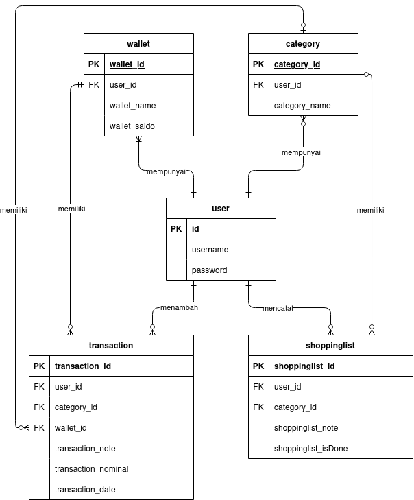
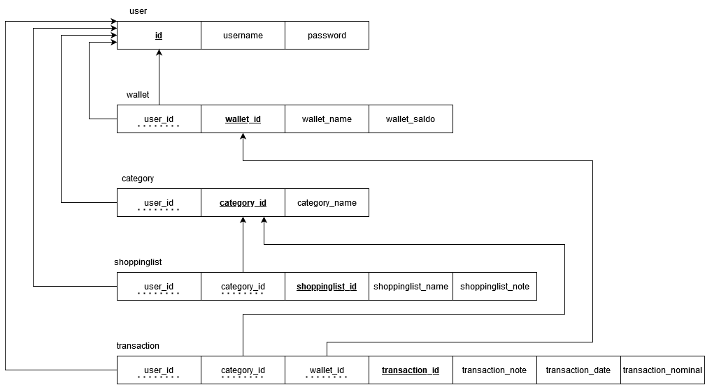

# SiBudi (Sistem Buku Keuangan Digital)


## Deskripsi
 SiBudi merupakan sebuah website pencatatan keuangan yang dibuat dalam rangka menyelesaikan permasalahan sulitnya proses pencatatan keuangan. SiBudi memiliki berbagai fitur yang dapat dimanfaatkan seperti mencatat pemasukan dan pengeluaran, mengkategorikan jenis-jenis pengeluaran dan pemasukan agar menjadi lebih personal serta memungkinkan kita juga untuk membuat lebih dari satu wallet yang bisa kita manajemen sesuai dengan peruntukannya pada masing-masing wallet. 
## Anggota Kelompok
|Nama|NIM|
|--|--|
|[Andyana Lilmuttaqina Mafaza](https://github.com/andyanamafaza4)|G6401211002
|[Irfan Alamsyah](https://github.com/irfanalmsyah)|G6401211029|
|[Andra Dihat Putra](https://github.com/andradp)|G6401211053|

## Daftar Isi
- [Entity Relationship Diagram](#entity-relationship-diagram)
- [Instalasi](#instalasi)
- [Tech Stack](#tech-stack)

# Entity Relationship Diagram


# Schematic Diagram


# Instalasi
<details>
    <summary>Dengan Docker</summary>
    <p>

## Prasyarat
- [Docker](https://docs.docker.com/get-docker/)

### 1. Clone repository ini
```bash
git clone https://github.com/irfanalmsyah/projectBasisData.git
```
### 2. Masuk ke direktori repository
```bash
cd projectBasisData
```
### 3. Buat file `.env` dari file [`.env.example`](.env.example)
```bash
cp .env.example .env
```
### 4. Jalankan docker-compose
```bash
docker-compose up
```
> server akan berjalan di `http://localhost:44444`
</details>
<details>
    <summary>Tanpa Docker</summary>
    <p>

## Prasyarat
- Python 3.9 atau lebih tinggi
- PostgreSQL jika ingin menggunakan database PostgreSQL
### 1. Clone repository ini
```bash 
git clone https://github.com/irfanalmsyah/projectBasisData.git
```
### 2. Masuk ke direktori
```bash
cd projectBasisData
```
### 3. Install dependensi
```bash
pip3 install -r requirements.txt
```
atau
```bash
python3 -m pip install -r requirements.txt
```
### 4. Buat file .env sesuai dengan [`.env.example`](.env.example)
```bash
cp .env.example .env
```
### 5. Masuk ke direktori `backend`
```bash
cd backend
```
### 6. Migrasi database
```bash
python3 manage.py makemigrations && python3 manage.py migrate
```
## 7. Jalankan server
```bash
python3 manage.py runserver
```
> Server akan berjalan di `http://localhost:8000`</p>
</details>

# Tech Stack
- [Django](https://www.djangoproject.com/)
- [Bootstrap](https://getbootstrap.com/)
- [PostgreSQL](https://www.postgresql.org/)
- [SQLite](https://www.sqlite.org/index.html)


